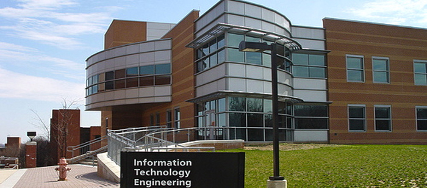

## About the Lab

Here at <a href="https://informationsystems.umbc.edu/"> the University of Maryland Baltimore Count (UMBC) Dept. of Information Systems (IS) </a>, our lab conducts deep learning research developing novel methods towards tasks in multivariate time series imputation for healthcare data, benchmarking and interpretability, survival modeling, competing risk analysis, domain adaptation, and multispectral image translation. We invite you to learn more about our team, current research, and published papers. The lab is always seeking motivated and experienced graduate students for exciting research opportunities, so stay tuned for announcements!

Led by Dr. Purushotham, we are currently working on deep learning applied to risk modeling, content retrieval, multispectral imaging, generative modeling, and natural language processing. Our work has been published at AAAI Conference on Artificial Intelligence, IEEE International Conference on Big Data (Big Data), several KDD workshops to include EpiDAMIK and DeepSpatial, IEEE International Conference on Image Processing, and medical journals to include the American Journal of Obstetrics and Gynecology and the Journal of Urology.

We invite you to learn more about the field of **Information Science**, an exciting and interdisciplinary field at UMBC, consisting of research in AI, data science, cybersecurity, and human centered computing. In this ecosystem, our lab is able to draw from a variety of academic experts in the department with experience in fields to include causality, fair learning, and computer vision, where we continue to integrate novel methods into our lab's research.

## Announcements

  
**Congratulations to Ph.D student, Md Mahmudur Rahman**, for his second place finish in the annual <a href="https://informationsystems.umbc.edu/home/research/is-poster-day/">IS Dept. PhD Poster Day</a>! Check out the winning paper <a href="https://ojs.aaai.org/index.php/AAAI/article/view/16125"> DeepPseudo: Pseudo Value Based Deep Learning Models for Competing Risk Analysis </a>.

## People

***Dr. Sanjay Purushotham*** 

 
Sanjay Purushotham is an Assistant Professor in the Department of Information Systems at the University of Maryland Baltimore County (UMBC). Before joining UMBC, he was a Postdoctoral Scholar Research Associate in the Department of Computer Science and Integrated Media Systems Center (IMSC) at the University of Southern California (USC), where he was mentored by Prof. Yan Liu and Prof. Cyrus Shahabi. He obtained his PhD in Electrical Engineering from USC under the supervision of Prof. C.-C. Jay Kuo in the Media Communications Labs (MCL). His research interests are in machine learning, data mining, optimization theory, statistics, computer vision and its applications to healthcare & bio-informatics, social networks and multimedia data.

***Md Mahmudur Rahman*** 

 
Rahman is a second year Ph.D student in Information Systems at the University of Maryland Baltimore County (UMBC), advised by Dr. Sanjay Purushotham. His research focus is on the application of machine learning and statistical learning to healthcare. His research interests include survival analysis, deep learning, causal inference, explainable AI, quantifying uncertainty in machine learning models. He completed my B.Sc. and M.Sc. in Statistics from the University of Dhaka, Bangladesh. Before joining UMBC, he was an assistant director in the statistics department of the central bank of Bangladesh. He loves music, traveling and playing soccer. 

***Catherine Ordun*** 
 
Catherine is a second year Ph.D student, who joined the lab after several years in industry. She began work at the Centers for Disease Control and Prevention (CDC) in Atlanta followed by work in defense and national security in Washington, D.C. She was a senior data scientist with Booz Allen Hamilton before starting the Ph.D program, having worked on a variety of AI and machine learning problems in defense and health. She is currently focused on visible-to-thermal image-to-image translation using GANs, in addition to multimodal pain detection using video, face detection, audio, and text for the National Institute of Health (NIH) and Booz Allen Hamilton. She enjoys running with her dogs, and lives abroad in Israel.

***Xiangyang Meng*** 

***Jal Irani***

 
Jal is a Ph.D. student in the Department of Information Systems at UMBC. His research interests are centered around machine learning and natural language processing. Jal is also a faculty member at Johns Hopkins Carey Business School and Towson University's Computer and Information Sciences Department where he primarily teaches full-stack web and mobile development courses.  

***Matthew Lee*** 

## Recent Publications

<a href="https://ojs.aaai.org/index.php/AAAI/article/view/16125">DeepPseudo: Pseudo Value Based Deep Learning Models for Competing Risk Analysis</a>
MM Rahman, K Matsuo, S Matsuzaki, S Purushotham
Proceedings of the AAAI Conference on Artificial Intelligence 35 (1), 479-487

<a href="https://ieeexplore.ieee.org/abstract/document/9377756">Deep Domain Adaptation based Cloud Type Detection using Active and Passive Satellite Data</a>
X Huang, S Ali, C Wang, Z Ning, S Purushotham, J Wang, Z Zhang
2020 IEEE International Conference on Big Data (Big Data), 1330-1337

<a href="https://par.nsf.gov/servlets/purl/10218874">The Use of AI for Thermal Emotion Recognition: A Review of Problems and Limitations in Standard Design and Data</a>
C Ordun, E Raff, S Purushotham
Proceedings of the AAAI Conference on Artificial Intelligence, arXiv preprint arXiv:2009.10589

<a href="https://arxiv.org/abs/2005.03082https://arxiv.org/abs/2005.03082">Exploratory Analysis of Covid-19 Tweets using Topic Modeling, UMAP, and DiGraphs</a>
C Ordun, S Purushotham, E Raff
epiDAMIK 3.0: The 3rd International workshop on Epidemiology meets Data

<a href="https://par.nsf.gov/servlets/purl/10217824">
Deep Multi-Sensor Domain Adaptation on Active and Passive Satellite Remote Sensing Data</a>
Xin Huang, Sahara Ali, Sanjay Purushotham, Jianwu Wang, Chenxi Wang, Zhibo Zhang
KDD Workshop on Deep Learning for Spatiotemporal Data, Applications, and …	1	2020
